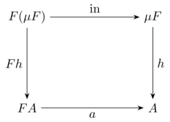
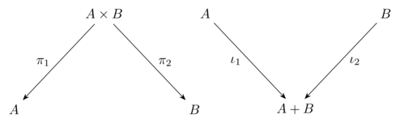

# Data and codata

## Initial algebras

Data and codata are really "two sides of the same coin." This correspondence can be traced back to category theory, where precise formal meaning is given to these concepts. 

An algebraic data type can be understood as the [initial algebra](https://en.wikipedia.org/wiki/Initial_algebra) of a functor. Intuitively, this means that it provides the smallest, well-founded solution to a type equation &mdash; one that can be consumed by a fold (a catamorphism). 

<p align="center">
  
</p>

## Pattern functors and fixed points

Data types are built from constructors. Consider the `List` type, for example:

```
type List<t> 
  = Nil
  | Cons(t, List<t>)
```

The *pattern functor* for a data type abstracts recursion by isolating one layer of the data structure, leaving the recursive portion as a parameter. For `List`, the corresponding pattern functor is:

```
type ListF<t, a> 
  = NilF
  | ConsF(t, a)
```

Notice that, unlike `List`, the type `ListF` is not recursive. In mathematical terms, this functor can be expressed by the equation:

$$
F(X) = \mathsf{1} + (t \times X)
$$

where

- $\mathsf{1}$ corresponds to `NilF`,
- $(t × X)$ corresponds to `ConsF(t, a)`.

The actual recursive type is the [fixed point](https://en.wikipedia.org/wiki/Fixed_point_(mathematics)) of $F$:

$$
\texttt{List<t>} \cong \mu F \cong F(\mu F)
$$

## Duality

Reversing the arrows is a recurring theme in category theory. Products and sum types describe ways of combining values: a product collects multiple values into one, while a sum, or *disjoint union*, represents a choice between alternatives. A disjoint union is sometimes also referred to as a *coproduct*. The reason is that a product is defined by a universal property that allows you to extract its components, whereas a coproduct is defined dually: it allows you to inject a value from one of the alternatives and to handle each case uniquely. 

<p align="center">
  
</p>

In other words, a disjoint union is the categorical dual of a product.

## Algebras and folds

An *algebra* for a functor $F$ is a type $A$ (the *carrier*) together with a function $F(A) \rightarrow A$. This function is called the *structure map* and it is precisely what the pattern matching clauses (along with the `@`-pattern syntax) in `fold` expressions describe:

```
fold(xs) {
  Nil           => 0
  Cons(x, @acc) => x + acc
}
```

The *initial* algebra $(\mu F, \text{in})$ is defined by the canonical map $\text{in} : F(\mu F) \rightarrow \mu F$. The carrier of this algebra is the data type itself (i.e., `List<t>` in this example). The fact that this is an initial object means that, for evey other algebra $A$, there is a unique function $h : \mu F \rightarrow A$ that makes the diagram commute. That unique morphism is precisely what the `fold` operator computes.

In the other direction, a codata type corresponds to the [final coalgebra](https://en.wikipedia.org/wiki/Initial_algebra#Final_coalgebra) of a functor: it is the largest (potentially infinite) solution that can be observed or generated by an unfold (anamorphism). In this description, algebras and coalgebras are each others’ duals. By simply reversing the direction of the arrows in their diagrams, an algebra turns into a coalgebra and vice versa.

<p align="center">
  
</p>
