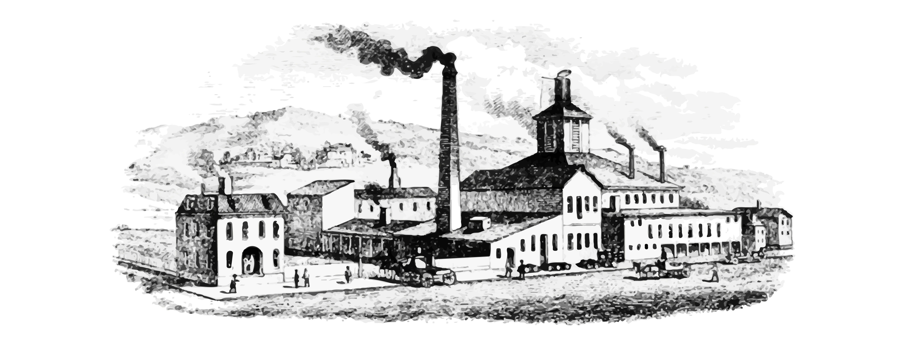

# Coal



This is the official documentation for the Coal programming language. 

## About

Coal is a declarative, statically typed, purely functional programming language with simple and intuitive syntax. It provides algebraic data types and pattern matching, extensible records, structural recursion, codata, corecursion, and traits (type classes), among other features. 

Coal’s type system, like Haskell’s and ML’s, supports type inference and parametric polymorphism, drawing on the [System-F](https://en.wikipedia.org/wiki/System_F) lambda calculus. The Coal compiler is implemented in Haskell and targets LLVM for code generation. The language is inspired by ideas from the field of Mathematics of Program Construction, where streams and other infinite data types are described as [coalgebras](https://coal-lang.org/data-and-codata/) — hence the name *Coal*.

This project is licensed under the terms of the MIT license. The source code is hosted at [codeberg.org/laserpants/coal](https://codeberg.org/laserpants/coal).


## Rethinking recursion

As a [total](https://en.wikipedia.org/wiki/Total_functional_programming) language, Coal takes a different approach to recursion, following the motto that "[recursion is the `goto` of functional programming](https://www.semanticscholar.org/paper/Functional-Programming-with-Bananas%2C-Lenses%2C-and-Meijer-Fokkinga/5db3c6793c07285bf0f5e95fe5a25f53e7488051)." To guarantee that programs are provably terminating, recursion is only available in a restricted form, known as *structural recursion*. Under this regime, each recursive call operates on a strictly smaller part of some finite data structure, progressing toward a base case. 

```
  fun sum(numbers : List<int32>) : int32 =
    fold(numbers) {
      | [] => 0 
      | x :: @tot => x + tot
    }
```

The special `@`-variable pattern used here makes `tot` recieve the result from calling the fold again using the sub-list matched by the pattern. 

A distinction is made between ordinary, finite data, which is produced and consumed in this way, and potentially infinite data &mdash; the kind that may result from processes that run indefinitely. The latter is known as *codata*. The codata equivalent of lists, for example, are *streams*.

```
  cotype Stream<a> = { Head : a, Tail : Stream<a> }

  unfold enum_from(n : int32) : Stream<int32> {
    , Head = n
    , @Tail = n + 1
  }

  let nats = enum_from(0)
```

In this example, the `@` in the field name causes the expression on the right (`n + 1`) to become the next seed value, which is fed back into `enum_from` to generate the continuation of the stream.

These code samples illustrate two distinct modes of recursive execution flow. If you are familiar with [recursion schemes](https://blog.sumtypeofway.com/posts/introduction-to-recursion-schemes.html) in a language like Haskell, recursion in Coal is based on the same principles. In that framework, `fold` and `unfold` are called *catamorphisms* and *anamorphisms*, respectively. 
